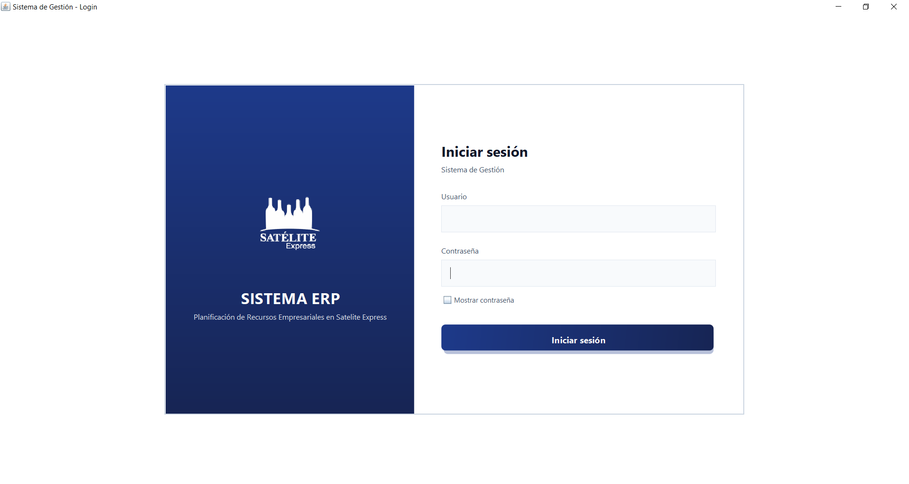
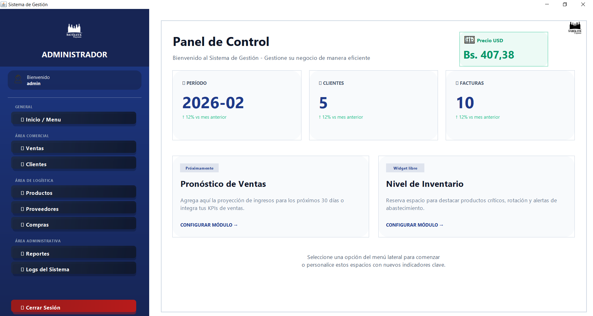
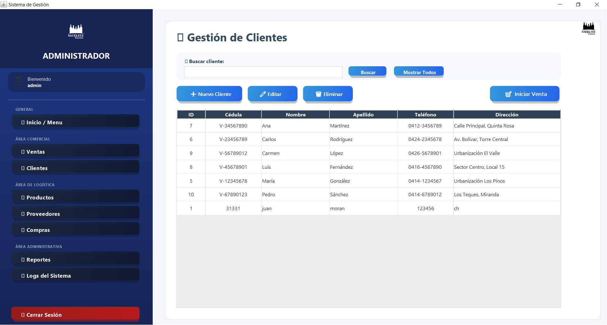
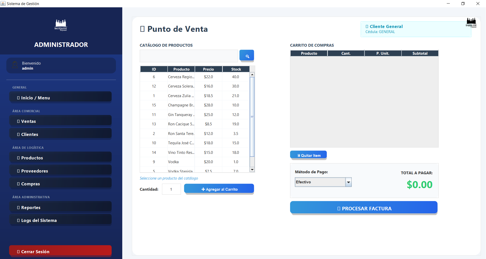
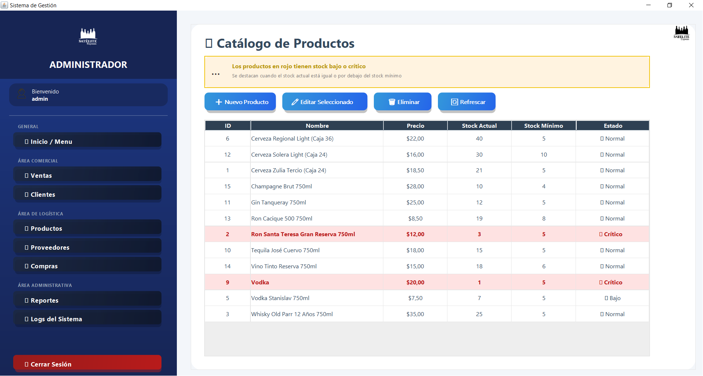
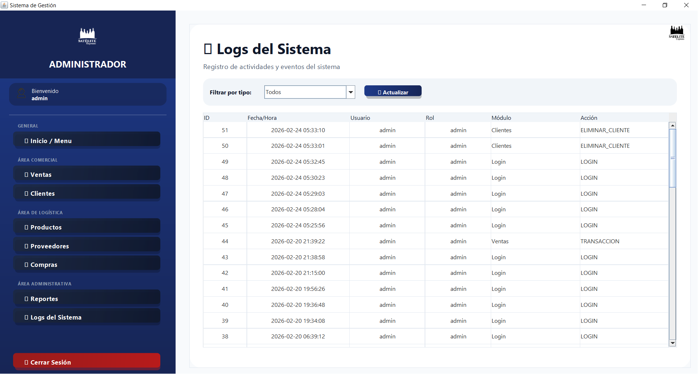

# 🏢 Sistema ERP - Satelite Express

Sistema de Planificación de Recursos Empresariales (ERP) desarrollado en Java con interfaz gráfica moderna para la gestión integral de ventas, inventario, clientes y proveedores.

## ✨ Características Principales

- **🔐 Autenticación por Roles**: Sistema de login con roles de administrador y vendedor
- **👥 Gestión de Clientes**: CRUD completo de clientes con búsqueda y filtros
- **📦 Catálogo de Productos**: Administración de inventario con control de stock
- **🛒 Punto de Venta**: Interfaz de facturación con carrito de compras
- **💵 Conversión de Moneda**: Integración con API para precio del dólar en tiempo real
- **🏢 Gestión de Proveedores**: Módulo para administrar proveedores (solo admin)
- **🚚 Módulo de Compras**: Registro de compras y entrada de inventario (solo admin)
- **📊 Reportes y Estadísticas**: Dashboard con KPIs y reportes de ventas (solo admin)
- **📋 Sistema de Auditoría**: Registro de operaciones críticas del sistema
- **🖨️ Generación de Facturas**: Facturas imprimibles con diseño profesional

## 📸 Capturas de Pantalla

### Interfaz Principal
| Login | Dashboard | Clientes |
|-------|-----------|----------|
|  |  |  |

### Módulos de Gestión
| Ventas | Productos | Logs |
|--------|-----------|------|
|  |  |  |

## 🛠️ Tecnologías Utilizadas

- **Lenguaje**: Java (JDK 17+)
- **Base de Datos**: SQLite 3
- **Interfaz Gráfica**: Java Swing con componentes personalizados
- **Librerías**:
  - `sqlite-jdbc-3.50.3.0.jar` - Driver JDBC para SQLite
  - API REST local para precio del dólar

## 📋 Requisitos Previos

- Java Development Kit (JDK) 17 o superior
- NetBeans IDE (recomendado) o cualquier IDE Java
- SQLite3 (opcional, para gestión manual de BD)

## 🚀 Instalación

### 1. Clonar el Repositorio

```bash
git clone https://github.com/JuanMoran12/java_system.git
cd java_system
```

### 2. Configurar Base de Datos

La base de datos `ventasdb.db` debe estar ubicada en `C:\ventasdb.db` (Windows).

**Opción A: Usar base de datos existente**
- Si ya tienes `ventasdb.db`, cópiala a `C:\`

**Opción B: Crear nueva base de datos**
```bash
# Ejecutar el script SQL de inicialización
sqlite3 C:\ventasdb.db < database/schema.sql
```

**Estructura de tablas principales:**
- `login` - Usuarios del sistema (usuario, clave, rol)
- `clientes` - Información de clientes
- `productos` - Catálogo de productos con stock
- `facturas` - Registro de ventas (incluye monto en USD y Bs)
- `proveedores` - Información de proveedores
- `compras` - Registro de compras a proveedores
- `audit_log` - Registro de auditoría del sistema

### 3. Ejecutar la Aplicación

**Usando NetBeans (Recomendado):**
1. Abrir el proyecto en NetBeans
2. Verificar que `sqlite-jdbc-3.50.3.0.jar` esté en las librerías
3. Ejecutar `Loginjuan.java` como aplicación principal

**Usando línea de comandos:**
```bash
# Compilar
javac -d build -cp "sqlite-jdbc-3.50.3.0.jar" src/loginjuan/*.java

# Ejecutar
java -cp "build;sqlite-jdbc-3.50.3.0.jar" loginjuan.Loginjuan
```

**Nota Windows:** Usar `;` como separador de classpath
**Nota Linux/Mac:** Usar `:` como separador de classpath

## 📁 Estructura del Proyecto

```
java_system/
├── database/
│   └── schema.sql                  # Esquema de base de datos
├── docs/                           # Capturas de pantalla
│   ├── I1.png - I5.png
├── src/
│   └── loginjuan/
│       ├── Loginjuan.java          # Punto de entrada principal
│       ├── ventana.java            # Ventana de login
│       ├── Opciones.java           # Menú principal y navegación
│       ├── ClientesModulo.java     # Gestión de clientes
│       ├── ProductosCatalogo.java  # Catálogo/inventario de productos
│       ├── Productos.java          # Punto de venta (carrito + checkout)
│       ├── Factura.java            # Generación e impresión de facturas
│       ├── Ventas.java             # Módulo de reportes
│       ├── Compras.java            # Módulo de compras
│       ├── ProveedoresModulo.java  # Gestión de proveedores
│       ├── LogsModulo.java         # Visualización de logs
│       ├── AuditLogger.java        # Registro de auditoría
│       └── DolarAPIClient.java     # Cliente API del dólar
├── sqlite-jdbc-3.50.3.0.jar       # Driver JDBC SQLite
├── logo_w.png / logo_b.png        # Logos del sistema
├── .gitignore
└── README.md
```

## 👥 Roles de Usuario

- **Administrador**: Acceso completo (ventas, compras, proveedores, reportes, logs)
- **Vendedor**: Acceso limitado (ventas, clientes, productos en modo lectura)

## 🤝 Contribuir

1. Fork el repositorio
2. Crea una rama para tu feature (`git checkout -b feature/nueva-funcionalidad`)
3. Commit tus cambios (`git commit -am 'Agregar nueva funcionalidad'`)
4. Push a la rama (`git push origin feature/nueva-funcionalidad`)
5. Abre un Pull Request

## 📝 Notas Importantes

- La base de datos debe estar en `C:\ventasdb.db` (ruta hardcodeada)
- Los logos deben estar en la raíz del proyecto: `logo_w.png`, `logo_b.png`
- El sistema registra todas las operaciones críticas en `audit_log`
- Las facturas guardan tanto el monto en USD como en Bs con la tasa del momento

## 📄 Licencia

Este proyecto es de código abierto y está disponible bajo la licencia MIT.

## 👨‍💻 Autor

Desarrollado por Juan Moran - [GitHub](https://github.com/JuanMoran12)
 [GitHub](https://github.com/JuanMoran12)
