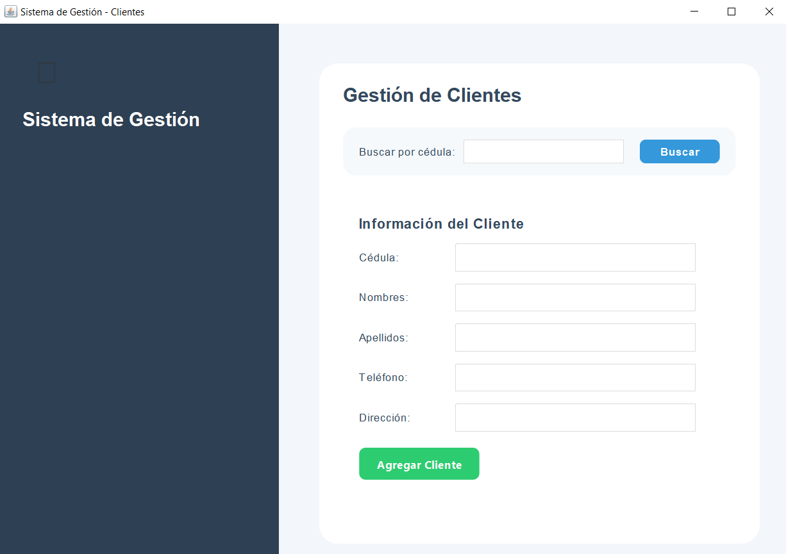
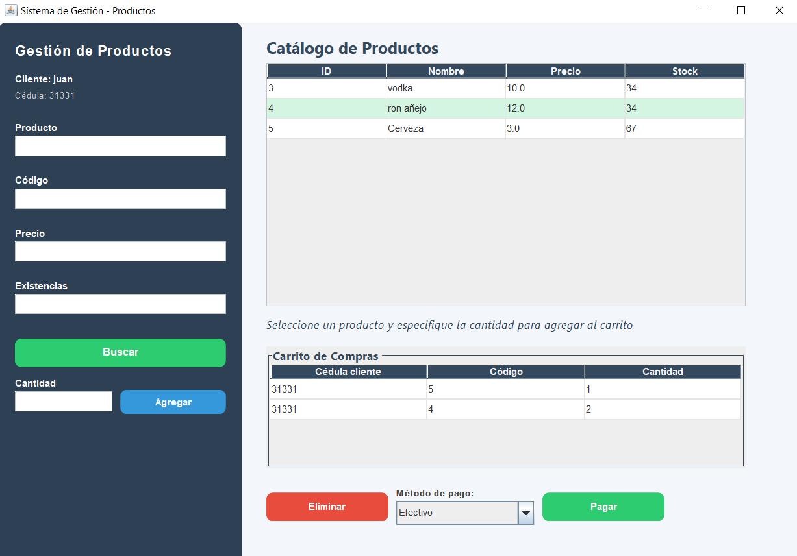
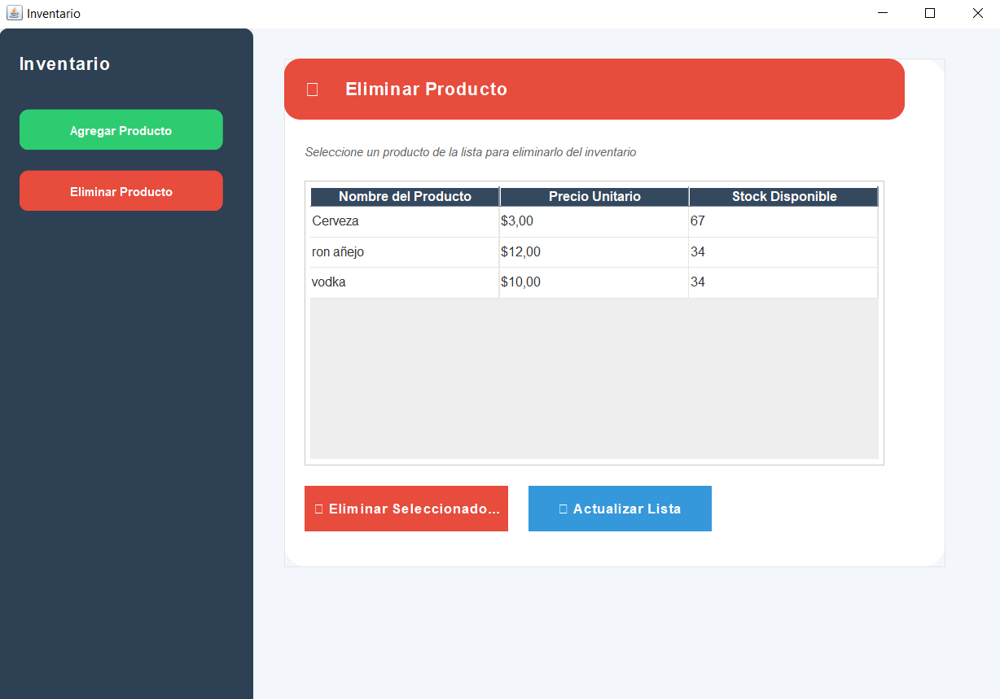
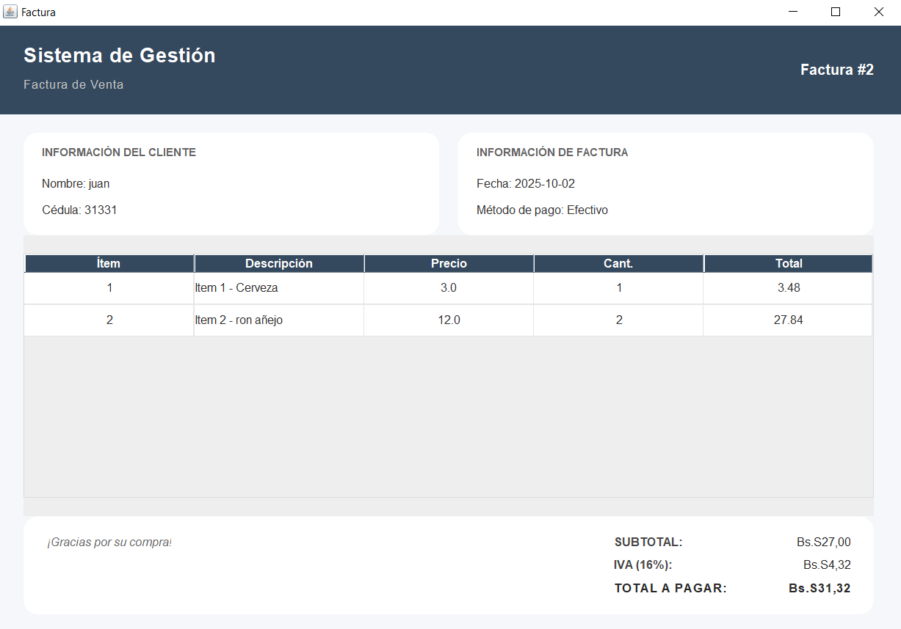

# Sales Management System

A Java-based Sales Management System with a graphical user interface for managing customers, products, invoices, and shopping carts.

## Features

- **User Authentication**: Secure login system with different user roles
- **Customer Management**: Add, view, and manage customer information
- **Product Catalog**: Manage product inventory with pricing and stock levels
- **Inventory Management**: Add and remove products from inventory with modern interface
- **Invoice Generation**: Create and manage sales invoices
- **Shopping Cart**: Temporary storage for items before checkout

## Screenshots

| Login Page | Main Menu | Customer Management |
|------------|-----------|-------------------|
|  |  |  |

| Product Catalog | Inventory Management |
|-----------------|---------------------|
|  |  |

## Technologies Used

- **Programming Language**: Java (JDK 17 or higher)
- **Database**: SQLite
- **Libraries**:
  - JDBC for database connectivity
  - Java Swing for GUI
  - SQLite JDBC Driver (included in `lib` directory)

## Prerequisites

- Java Development Kit (JDK) 17 or higher
- SQLite3 (for database management)
- Git (for version control)

## Setup Instructions

### 1. Clone the Repository

```bash
git clone https://github.com/JuanMoran12/java_system
cd sales-management-system
```

### 2. Database Setup

1. **Install SQLite** (if not already installed):
   - Windows: Download from [SQLite Download Page](https://www.sqlite.org/download.html)
   - macOS: `brew install sqlite`
   - Linux: `sudo apt-get install sqlite3`

2. **Create and Initialize the Database**:
   ```bash
   # Navigate to the database directory
   cd database
   
   # Create a new SQLite database
   sqlite3 ventasdb.db
   
   # Run the schema script
   .read schema.sql
   
   # Exit SQLite prompt
   .exit
   ```

### 3. Configure Database Connection

Update the database connection string in `src/loginjuan/ventana.java` if needed:

```java
// Update this line with the correct path to your database
Connection con = DriverManager.getConnection("jdbc:sqlite:ventasdb.db");
```

### 4. Build and Run the Application

#### Using an IDE (Recommended)
1. Open the project in your Java IDE (NetBeans, IntelliJ IDEA, or Eclipse)
2. Add the SQLite JDBC driver (`sqlite-jdbc-3.50.3.0.jar`) to your project's libraries
3. Run the `Loginjuan.java` file as a Java Application

#### Using Command Line
```bash
# Navigate to the project root directory
cd path/to/sales-management-system

# Compile all Java files
javac -d bin -cp "lib/*" src/loginjuan/*.java

# Run the application
java -cp "bin;lib/*" loginjuan.Loginjuan
```

## Project Structure

```
sales-management-system/
├── database/
│   └── schema.sql          # Database schema and initial data
├── lib/
│   └── sqlite-jdbc-3.50.3.0.jar  # SQLite JDBC driver
├── src/
│   └── loginjuan/
│       ├── Loginjuan.java  # Main application entry point
│       ├── ventana.java    # Main GUI and business logic
│       ├── Productos.java  # Product management
│       ├── Clientes.java   # Customer management
│       ├── Inventario.java # Inventory management
│       └── Opciones.java   # Main menu and navigation
├── .gitignore             # Git ignore file
└── README.md              # This file
```

## Default Login Credentials

- **Username**: admin
- **Password**: admin123

## Contributing

1. Fork the repository
2. Create a new branch (`git checkout -b feature/your-feature`)
3. Commit your changes (`git commit -am 'Add some feature'`)
4. Push to the branch (`git push origin feature/your-feature`)
5. Open a Pull Request

## License

This project is licensed under the MIT License - see the [LICENSE](LICENSE) file for details.
